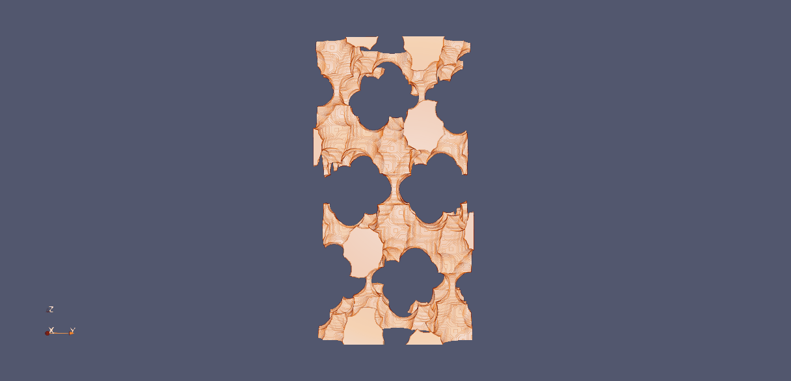
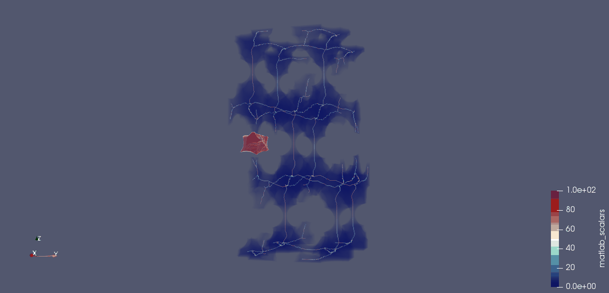
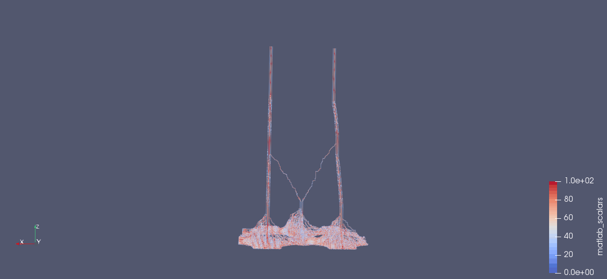

## Table of contents
* [General info](#general-info)
* [Dependencies](#dependencies)
* [Setup](#setup)
* [Usage](#usage)
* [Status](#status)
* [References](#references)
* [Issues](#issues)


## General info
atomMKS is a tool for the analytics of porous molecular structures.

The Molecular Structure of DDR: 

The pore region of DDR embedded within the molecular structure. 

The pore region of DDR accessible by a 1.5A radius probe is visualized as below: 

The skeleton of the pore structure overlayed on the pore volume is visualized as below: 

The shortest paths for the probe through the pore structure are visualized as below: 


## Dependencies
Project is created with:
* ase==3.23.0
* scikit-image==0.24.0
* scipy==1.14.1
* numpy==1.26.4
* numba==0.60.0
* torch==2.5.0
* toolz==1.0.0


## Setup
To run this project, install it locally using conda:

```
$ cd ../<project_directory>
$ conda create -n atom python=3.10
$ conda activate atom
$ pip install -r requirements.txt
$ pip install atommks
```
Conda is a package and environment manager bundled with anaconda python distribution.
See, [https://www.continuum.io/downloads](https://www.continuum.io/downloads) for more details on installing and using Conda.  

**Windows Users** need to install visual studio build tools, in order to the compile c/c++ files assosciated with some of the dependencies.


## Usage
Refer to the [jupyter notebook](./tutorial/tutorial_atomMKS.ipynb) in the doc folder.


We provide two scripts to analyze structure files in bulk

#### 1. Generate and save grid-representations to disc for a list of CIF files

```
Usage: gen_gridStructures.py [OPTIONS]

  Command-line tool to process structures in CIF format with parallel
  processing. # noqa: E501

Options:
  -i, --input-dir PATH     Input directory containing CIF files.  [required]
  -o, --output-dir TEXT    Output directory to save processed files.
                           [required]
  -l, --len-pixel INTEGER  Length of pixel grid (default is 10).
  -r, --rep TEXT           Repeat the structure (default is "1,1,1").
  -p, --processes INTEGER  Number of parallel processes to use (default is 1).
  --help                   Show this message and exit.
```

#### 2. Used the saved grid-representations from prior set to compute and save pore characteristics

```
Usage: gen_poreMetrics.py [OPTIONS]

  Command-line tool to process MAT files for pore structure analysis.

Options:
  -i, --input-folder PATH   Input folder containing MAT files.  [required]
  -o, --output-folder PATH  Output folder to save processed files.  [required]
  -r, --r-probe FLOAT       Probe radius (default is 1.0).
  -l, --len-pixel INTEGER   Number of voxels per angstrom (default is 10).
  -p, --processes INTEGER   Number of parallel processes (default is 2).
  --help                    Show this message and exit.
```

## Status
atomMKS is currently under active development.


## References
[EDT](https://github.com/seung-lab/euclidean-distance-transform-3d/)  
[scikit-image](https://scikit-image.org/)  


## Issues

Please send questions and issues about installation and usage of PyMKS to [apaar92@gmail.com](mailto:apaar92@gmail.com)


## Lint instructions

```
black --line-length 79 .
isort .
flake8 .
```


## Docker set-up

```
docker network create nanoporous-network
# start the service
./start_db_service.sh
stop the service
./stop_db_service.sh
```